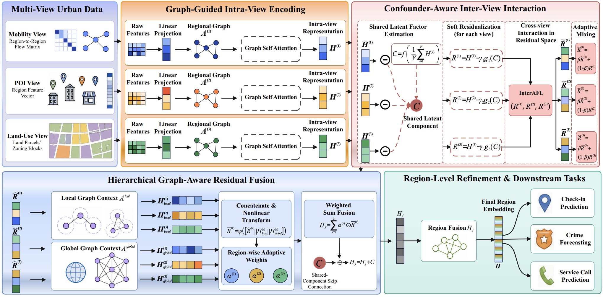

# When Correlations Mislead: Confounder-Aware Multi-View Urban Region Representation Learning

The pytorch implementation of paper "When Correlations Mislead: Confounder-Aware Multi-View Urban Region Representation Learning". 

## Framework
<div align=center>

</div>


## Requirements

Given a python environment, install the dependencies with the following command:

```shell
pip install -r requirements.txt
```

## Training

You can train **CURE** through the following commands：
```shell
chmod +x ./run.sh
./run.sh
```
